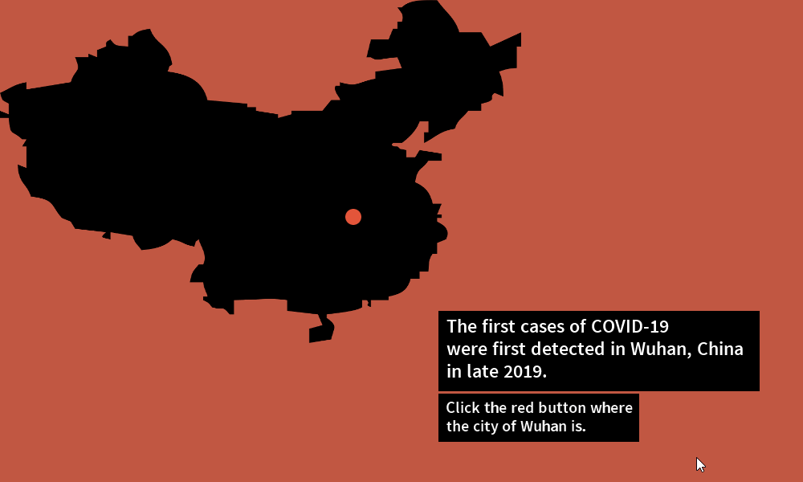
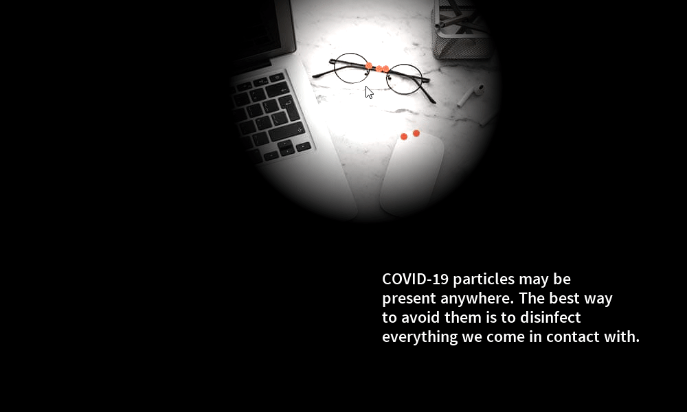

# COVID-19 Interactive Animation
Follow the instructions on each scene. Once all the instructions are done, you have to enter the spacebar to go to the next scene.

Detailed instruction:

Scene 1: Main title
1. Press spacebar to go to the next scene

Scene 2: Origin of COVID-19
1. Press the red dot on the map to reveal more information
2. Press spacebar to go to the next scene

Scene 3: Name of COVID-19
1. Roll the mouse closer to the center of the window to see the changes in the scene
2. Press spacebar to go to the next scene

Scene 4: Office
1. Click the mouse to see the particle animation behind the human figure
2. Press spacebar to go to the next scene

Scene 5: COVID-19 Anyhere
1. Roll the mouse to view the hidden COVID-19 particles
2. Press spacebar to go to the next scene

Scene 6: Social Distancing
1. Press the UP key six times
2. Press the 'm' key to see the changes on the image

Scene 7: COVID-19 Transmission
1. Click anywhere on the screen to view the COVID-19 transmission
2. Press spacebar to go to the next scene

Warning:
Due to the size of the images, the program might lag or be unresponsive sometimes 
(e.g. entering the spacebar may delay the transition to the next scene).

## Demo

    
    
    
    
    
    

